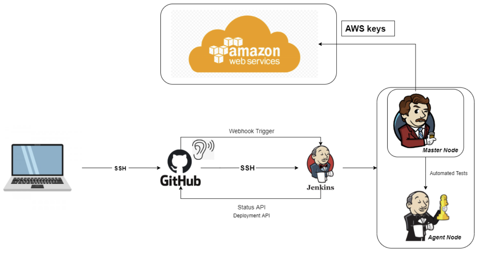
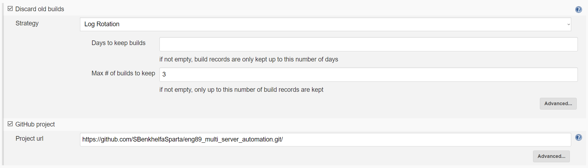
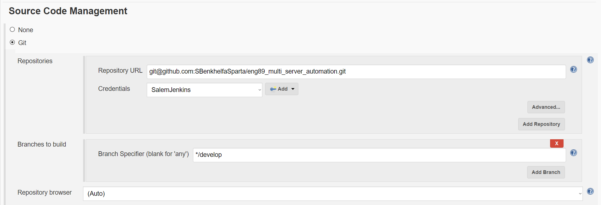

## Creating Jobs in Jenkins
- Log into the jenkins webserver at http://35.176.10.123:8080/
- Create a New Item
- Name it and select "Freestyle Project"
- Tick discard old builds and set max number of builds to 3
- At the bottom in the build section select "Execute shell" and type something like `pwd` to test if it is working
- In the Post-build Actions you can select another job you have created so that it runs at the end of this job's execution.
- Click Save

## Setting up Automatic Merging Into Main
You need two branches and two jobs. Set the jobs up with these settings:



The first job should have these settings:
- Tick `GitHub hook trigger for GITScm polling`
- Tick `Provide Node & npm bin/ folder to PATH`
- Select "Execute shell" in `Build` and enter this code:
```
cd app
npm install
npm test
```
- Make your job run the second job on completion by entering its name in "Build other projects" in `Post-build Actions`.

The second job should have these settings:
- In `Source Code Management` add "Merge before build" with name "origin" and branch "main"
- Execute a shell like with the previous job and enter this code:
```
git checkout main
git merge origin/develop
```
- In `Post-build Actions` select "Git Publisher" and tick "Push Only If Build Succeeds" and add a branch. "Branch to push" should be "main" and "Target remote name" should be "origin"

Before pushing anything head over to the repo's settings on GitHub and add a webhook with URL "http://18.130.192.218:8080/github-webhook/". Content type should be json. Just the push event should be selected with "Active" ticked. This is what will trigger the first job via GitHub's webhook signal.
